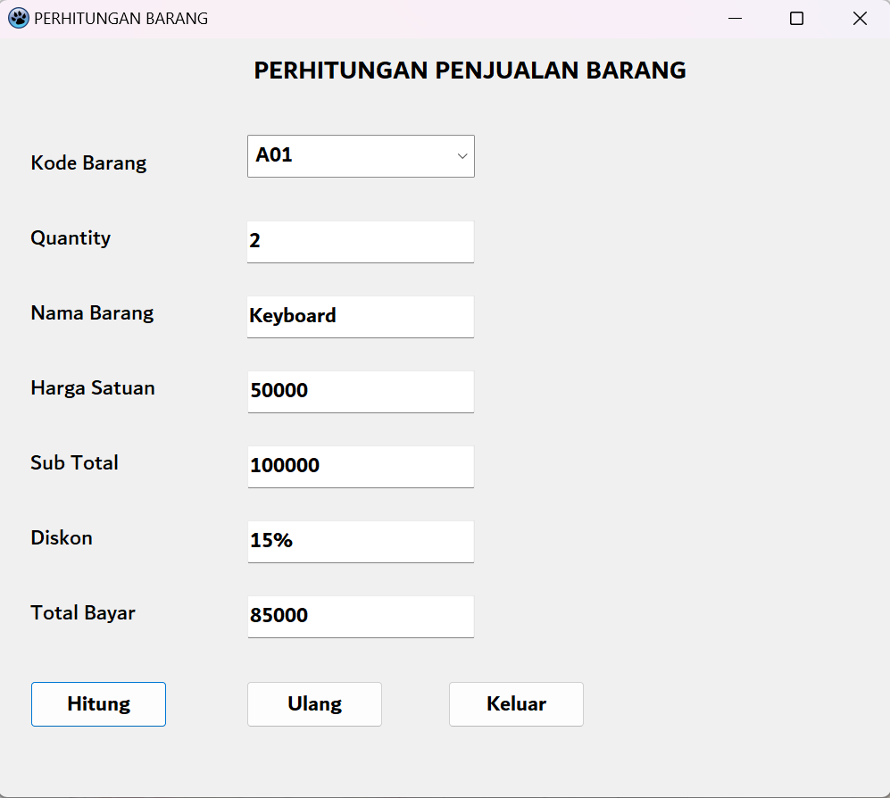

# Latihan 2 - Pemograman Visual ( Dekstop )

**Nama   : _Alif Dwi Putra_**  
**NIM    : 312110401**  
**Kelas  : TI . 21 . A3**  
**Matkul : Pemograman Visual Dekstop**  
 

## Result Menghitung Gaji Karyawan

## Result Penjualan Barang

## Result Menghitung Deret N

